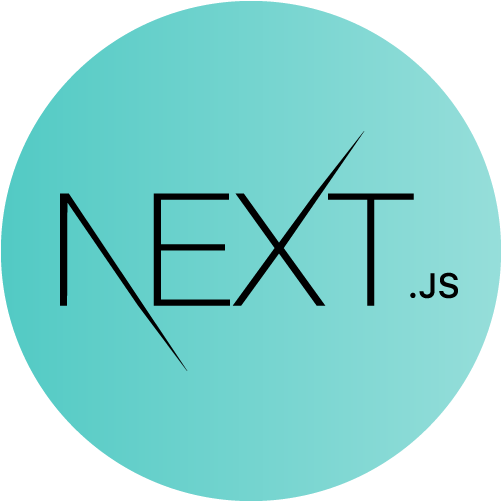
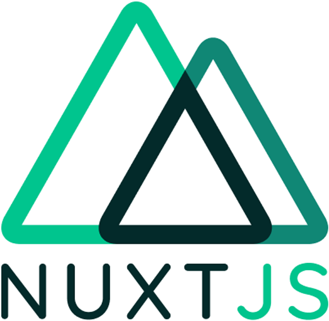

<!-- Social icons section -->
<h1 align="center"> Social Media: </h1>
  

    
    
    
  

</h1>

<!-- Description about me -->
<h2 align="center"> 🤔 About me 👨‍💻 </h2>

Eyyyy!!!  
I am <b>Wesley Ukadike</b>  
I am from <strong>NIgeria 🇳🇬  
A passionate developer who loves to create magic  🖥️   
So... I am more than a robot coding 🤖, I am a real human trying to learn new things and develop incredible projects with ❤️ meeting incredible people on the way🚀  
If you are interested in a guy with a good vibe who loves the knowledge and the constant learning 📚, <b>⚙️I AM YOUR GUY⚙️</b>   
Contact me for new projects 📨, I am open to collaborate with you
   

### 🧐 More About Me:
<table style="border: none;">
  <tr style="border: none;">
    <td style="border: none;">
      <ul>
        <li>
          🔭 Prospecting student at Conestoga College Canada
        </li>
        <li>
          🤝 I’m looking to collaborate on Open Source Proyects
        </li>
        <li>
          🌱 I’m currently learning Flutter & NestJS; 
        </li>
        <li>
          👨🏻‍💻 Most of my projects are available on [Github](https://github.com/kaypappi?tab=repositories)
        </li>
        <li>
          💬 Ask me about anything tech related, I am happy to help;
        </li> 
        <li>
          📫 Feel free to contact me on [LinkedIn](https://www.linkedin.com/in/wesley-ukadike-3a9440180/)
        </li>
        <li>
          🏓 When I am free, I like to play table tennis 🏓        </li>
        <li>
          📝 Checkout my [Page](https://wesleyukadike.dev/) 
        </li>
    </td>
  </tr>
</table>
   

<!-- languajes and skills section -->

<h1 align="center"> Languages/Frameworks I'm good at: </h1>

  <code></code>
  <code></code>
  <code></code>
  <code></code>
  <code></code>
  <code></code>
  <code></code>
  <code></code>
  <code></code>
  <code></code>
  <code></code>

 

<h1 align="center"> Languages/Frameworks I'm learning: </h1>

  <code></code>
  <code></code>
  <code></code>

 

<h1 align="center"> Environments I work with: </h1>

  <code></code>
  <code></code>
  <code></code>

 

<!-- GitHub stats section -->

## 📊 Github stats

<!-- Bassed on: https://github.com/anuraghazra/github-readme-stats -->

   
  
  
   
  <b>Note:</b> Top languages is only a metric of the languages my public code consists of and doesn't reflect experience or skill level.

<!-- last activity section -->
 
   
   
## Activity Graph

  

 

<!-- last refresh of readme section -->

Last refresh: <b>Sunday, February 26, 7:18 AM GMT-5</b>
